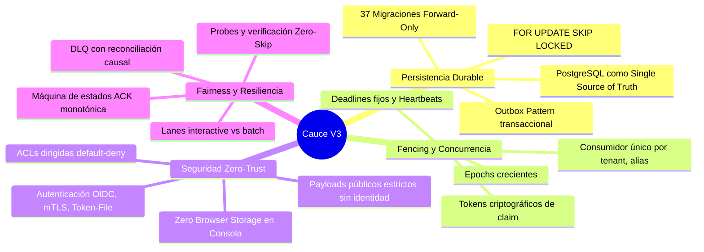
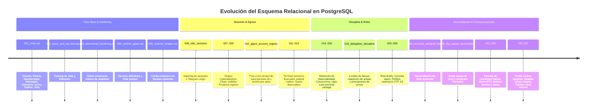
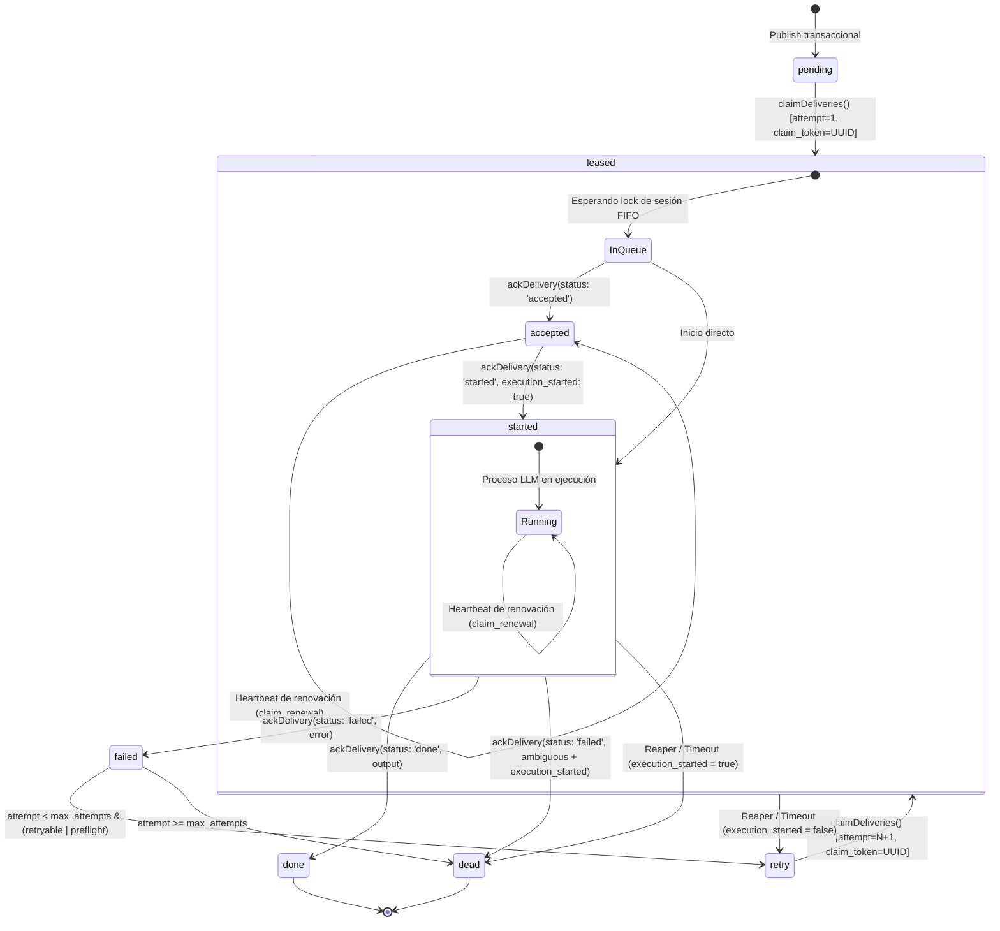
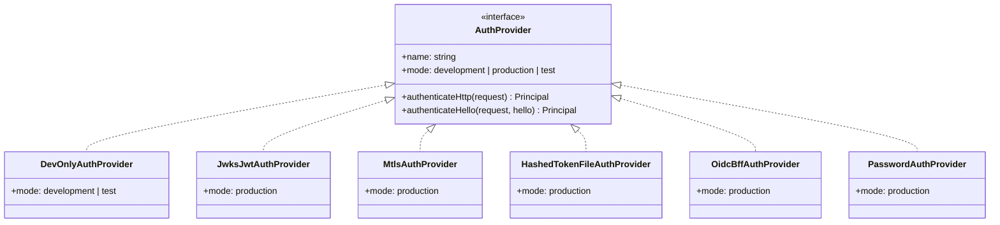
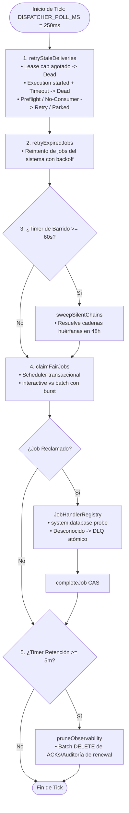
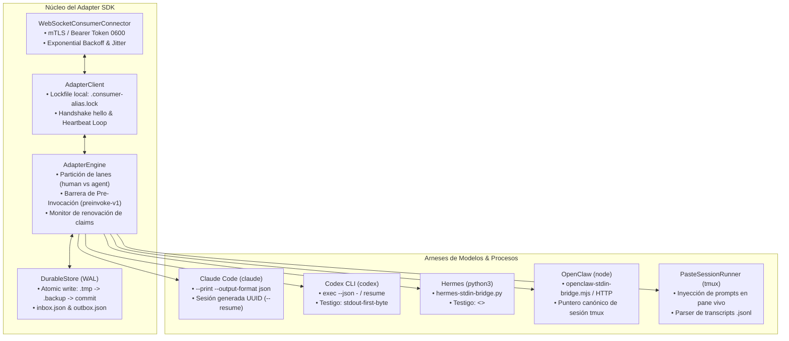
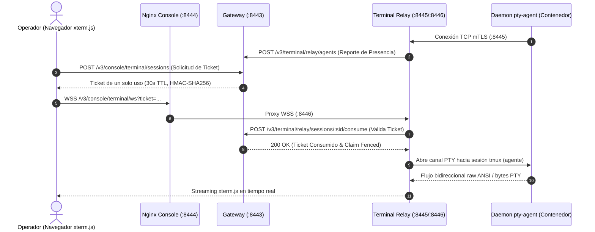
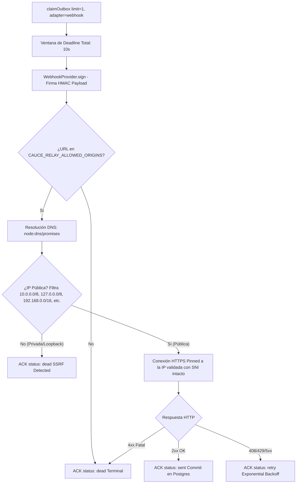
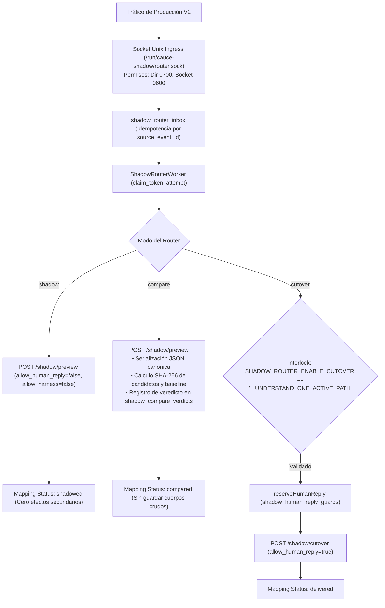
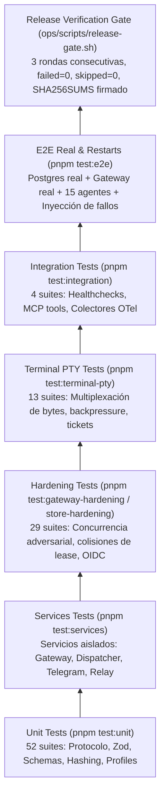

# Arquitectura Integral y Exhaustiva del Sistema — Cauce V3

---

## Tabla de Contenidos

1. [Visión General y Principios Fundamentales](#1-visión-general-y-principios-fundamentales)
2. [Topología y Arquitectura del Sistema (Diagrama Global)](#2-topología-y-arquitectura-del-sistema-diagrama-global)
3. [Inventario Completo de Directorios y Archivos del Repositorio](#3-inventario-completo-de-directorios-y-archivos-del-repositorio)
4. [Protocolo Wire V3.0 (`packages/protocol`)](#4-protocolo-wire-v30-packagesprotocol)
5. [Base de Datos PostgreSQL, Migraciones y Persistencia Transaccional (`packages/store`)](#5-base-de-datos-postgresql-migraciones-y-persistencia-transaccional-packagesstore)
6. [Gateway y Seguridad Perimetral (`services/gateway`)](#6-gateway-y-seguridad-perimetral-servicesgateway)
7. [Dispatcher, Colas y Fairness Transaccional (`services/dispatcher`)](#7-dispatcher-colas-y-fairness-transaccional-servicesdispatcher)
8. [SDK de Adaptadores, Ejecución y Arneses LLM (`packages/adapter-sdk`)](#8-sdk-de-adaptadores-ejecución-y-arneses-llm-packagesadapter-sdk)
9. [Terminal Relay y Control PTY (`services/terminal-relay`)](#9-terminal-relay-y-control-pty-servicesterminal-relay)
10. [Trabajador de Retransmisión y Egress (`services/relay-worker`)](#10-trabajador-de-retransmisión-y-egress-servicesrelay-worker)
11. [Puente de Telegram (`services/telegram-bridge`)](#11-puente-de-telegram-servicestelegram-bridge)
12. [Enrutador Shadow y Migración V2↔V3 (`services/shadow-router`)](#12-enrutador-shadow-y-migración-v2v3-servicesshadow-router)
13. [Consola Web de Operaciones (`apps/console`)](#13-consola-web-de-operaciones-appsconsole)
14. [Monitor de Flota MCP (`packages/mcp-fleet-monitor`)](#14-monitor-de-flota-mcp-packagesmcp-fleet-monitor)
15. [Despliegue, Infraestructura y Contenedores (`deploy/`)](#15-despliegue-infraestructura-y-contenedores-deploy)
16. [Operaciones, Runbooks, Harnesses y Gates (`ops/`)](#16-operaciones-runbooks-harnesses-y-gates-ops)
17. [Modelo de Amenazas, ADRs y Seguridad de Confianza Cero](#17-modelo-de-amenazas-adrs-y-seguridad-de-confianza-cero)
18. [Estrategia de Verificación y Testing de Cero Falsos Positivos](#18-estrategia-de-verificación-y-testing-de-cero-falsos-positivos)
19. [Catálogo Exhaustivo de Código Inerte, Componentes Retirados, Mocks, Campos Sin Efecto y Diseños Diferidos](#19-catálogo-exhaustivo-de-código-inerte-componentes-retirados-mocks-campos-sin-efecto-y-diseños-diferidos)

---

## 1. Visión General y Principios Fundamentales

**Cauce V3** es un monorepo canónico de mensajería multi-tenant durable, orquestación de agentes inteligentes y plano de control operacional. Está diseñado con aislamiento estricto respecto a sistemas legados (V2): no comparte memoria mutable, base de datos ni sockets vivos, y su ejecución es fail-closed por defecto.



### Invariantes Arquitectónicas No Negociables
1. **PostgreSQL es la única fuente transaccional:** Ningún mensaje, entrega, lease, ACK, job ni estado de outbox se considera vivo hasta que se confirma en PostgreSQL. Las conexiones WebSocket actúan solo como aceleradores push de baja latencia; tras una reconexión, la cola siempre se rehidrata directamente desde la base de datos.
2. **Consumidor único por `(tenant, alias)` con cercado monotónico:** Una tupla `(tenant_id, alias)` solo puede tener un proceso consumidor activo. Al conectarse un nuevo socket o expirar un lease, se incrementa el `epoch`; cualquier frame, heartbeat o ACK proveniente de un socket antiguo o con `claim_token` caducado es rechazado inmediatamente (*fenced*).
3. **Máquina de estados de ACK estrictamente monotónica:** `pending` / `leased` $\to$ `accepted` $\to$ `started` $\to$ `done` | `failed` | `dead`. Cada intento genera un `claim_token` único (UUIDv4) y un número de intento (`attempt`). Los heartbeats y extensiones de deadline (`claim_renewal`) no extienden el límite máximo de ejecución total (*lease cap*).
4. **Frontera de identidad estricta (*Strict Auth Boundary*):** Los payloads públicos de publicación (`AuthenticatedPublishSchema`) tienen prohibido contener `tenant_id`, `actor_alias`, `request_id`, `session_id`, `channel`, `origin` o `trace_id`. Toda identidad es derivada de forma determinista por el Gateway a partir del `Principal` autenticado (mTLS, OIDC o token seguro).
5. **Enrutamiento y Control de Acceso Default-Deny:** Las comunicaciones entre agentes y salas requieren membresía activa y una arista ACL dirigida en la base de datos (`allow_route`, `allow_read`, `allow_control`, `allow_notify`). No existen permisos implícitos ni enums de tenants hardcodeados en el protocolo.
6. **Configuración mutable versionada con OCC y Rollback:** Toda mutación sobre tenants, salas, membresías, agentes, cuentas y ACLs pasa por un bloqueo transaccional global (`783_003_004`), verificación optimista de revisión (`expected_revision`), registro de diffs inversos y generación de auditoría. El rollback aplica la mutación inversa como una **nueva** revisión hacia adelante.

---

## 2. Topología y Arquitectura del Sistema (Diagrama Global)

```mermaid
flowchart TB
    subgraph Clients["Clientes & Red Perimetral"]
        Browser["Navegador Web / Operador<br/>(apps/console)"]
        Telegram["Telegram Bot API<br/>(Ecosistema Móvil/Desktop)"]
        LegacyV2["Sistema Legado V2<br/>(Unix Domain Socket)"]
        Agents["Agentes de IA & Daemons<br/>(Claude, Codex, Hermes, OpenClaw)"]
    end

    subgraph Ingress["Capa Ingress & Reverse Proxy"]
        NginxConsole["Nginx Console TLS (:8444)<br/>(apps/console, CSP, Same-Origin)"]
        UnixSock["Socket Unix Ingress (/run/cauce-shadow)<br/>(Permisos 0700/0600)"]
    end

    subgraph CoreServices["Servicios Core (Runtime)"]
        Gateway["services/gateway (:8443)<br/>• Fastify HTTP & WebSocket (/v3/ws)<br/>• Auth Boundary (mTLS, OIDC, Password)<br/>• Admission & Outbox Wake Pump"]
        Dispatcher["services/dispatcher (:8082)<br/>• Fairness Scheduler (interactive/batch)<br/>• Stale Delivery Reaper<br/>• DLQ & Retention Pruner"]
        TerminalRelay["services/terminal-relay (:8445/:8446)<br/>• PTY Agent Leg (mTLS)<br/>• Browser xterm Leg<br/>• Ticket Fencing & Governance"]
        RelayWorker["services/relay-worker (:8083)<br/>• Outbox Claim Worker<br/>• HTTPS Egress con DNS/IP Pinning<br/>• Webhook Delivery"]
        TelegramBridge["services/telegram-bridge (:8086)<br/>• Long-Polling con Lease Fence<br/>• P0-P10 Addressing Matrix<br/>• Anti-Double-Response Egress"]
        ShadowRouter["services/shadow-router<br/>• Enrutador Bidireccional V2↔V3<br/>• Modos: shadow, compare, cutover<br/>• Guardias de Respuesta Humana"]
        MCPMonitor["packages/mcp-fleet-monitor<br/>• Servidor MCP stdio/HTTP<br/>• Modelo de Lectura de Flota"]
    end

    subgraph Persistence["Capa de Persistencia & Estado Único"]
        Postgres[("PostgreSQL 16+<br/>• Migraciones 001..037<br/>• FOR UPDATE SKIP LOCKED<br/>• Advisory Locks & Outbox<br/>• sslmode=verify-full")]
    end

    %% Conexiones
    Browser -->|HTTPS / WSS| NginxConsole
    NginxConsole -->|HTTP Proxy| Gateway
    NginxConsole -->|WSS PTY Proxy| TerminalRelay
    Telegram <-->|HTTPS API Long-Poll / Send| TelegramBridge
    LegacyV2 <-->|Unix Socket| UnixSock
    UnixSock --> ShadowRouter
    Agents <-->|mTLS / WSS (/v3/ws)| Gateway
    Agents <-->|mTLS TCP (:8445)| TerminalRelay

    Gateway <-->|SQL Transaccional / Wakes| Postgres
    Dispatcher <-->|SQL Transaccional / Reaping| Postgres
    RelayWorker <-->|Outbox Lease Claims| Postgres
    TelegramBridge <-->|Cursor & Egress Effects| Postgres
    ShadowRouter <-->|Inbox & Mappings| Postgres
    MCPMonitor -.->|Consultas Read-Only| Postgres
    TerminalRelay <-->|HTTPS Machine Plane /v3/terminal/relay| Gateway
```

---

## 3. Inventario Completo de Directorios y Archivos del Repositorio

A continuación se detalla la estructura física y lógica completa de cada componente del repositorio:

```
cauce-v3/
├── apps/
│   └── console/               # Aplicación Frontend SPA (React 19, Vite, xterm.js, Nginx)
├── deploy/                    # Configuración de despliegue, Dockerfiles, Compose, Probes, TLS
├── docs/                      # Decisiones de arquitectura (ADRs 001..006), Threat Model, Planes
├── ops/                       # Automatización de QA real/mock, runbooks, scripts, gates y manifests
├── packages/
│   ├── adapter-sdk/           # SDK canónico para adaptadores de agentes, arneses y sesiones tmux
│   ├── mcp-fleet-monitor/     # Servidor MCP (Model Context Protocol) para inspección de flota
│   ├── protocol/              # Esquemas Zod V3.0, prioridad, recibos de publicación y límites
│   └── store/                 # Repositorio PostgreSQL, 37 migraciones SQL, transacciones, OCC
├── scripts/                   # Scripts auxiliares de tests, hooks de resolución de paquetes
├── services/
│   ├── dispatcher/            # Planificador de colas, fairness de lanes, reaper y retenciones
│   ├── gateway/               # Servidor HTTP/WebSocket Fastify, autenticación y fachadas
│   ├── relay-worker/          # Trabajador de outbox con egress HTTPS y pinning DNS/TLS
│   ├── shadow-router/         # Enrutador shadow bidireccional V2↔V3 sobre sockets Unix
│   ├── telegram-bridge/       # Puente de Telegram (Long-polling, direccionamiento, egress seguro)
│   └── terminal-relay/        # Servidor de multiplexación PTY para terminales de agentes
├── tests/                     # Suites de testing: unit, services, integration, hardening, e2e
├── Makefile                   # Automatización de compilación, verificación y migraciones
├── package.json               # Definición de scripts del monorepo y dependencias globales
├── pnpm-lock.yaml             # Lockfile determinista pnpm v11
├── pnpm-workspace.yaml        # Configuración del workspace monorepo
├── tsconfig.json              # Configuración TypeScript estricta con alias locales
├── tsconfig.build.json        # Configuración de compilación a dist/
└── vitest.config.ts           # Configuración del runner Vitest con resolución local
```

---

## 4. Protocolo Wire V3.0 (`packages/protocol`)

Ubicación: `/datos/workspaces/zeus/cauce-v3/packages/protocol`

### 4.1 Responsabilidades de Archivos
* `src/index.ts`: Barrel de exportación pública de esquemas, tipos y utilidades.
* `src/schemas.ts`: Definición formal en Zod de todas las estructuras de datos (versión `PROTOCOL_VERSION = '3.0'`). Define payloads, frames WebSocket (`hello`, `hello_ack`, `heartbeat`, `delivery`, `ack`, `ack_result`, `wake`), mensajes, mutaciones y reportes.
* `src/priority.ts`: Define las bandas de prioridad para evitar inanición. Los agentes automáticos tienen un techo (`AGENT_PRIORITY_CEILING = 50`), mientras que los operadores humanos se reservan la banda superior (`HUMAN_PRIORITY_FLOOR = 60`, `HUMAN_CHAT_PRIORITY = 70`). Rango total: `[-100, 100]`.
* `src/publish-receipt.ts`: Generación determinista de hashes SHA-256 para idempotencia (`publishRequestHash`), preflights de intención de consola (`consolePublishIntentSemanticHash`) y recibos causales de publicación (`publishReceiptCausalHash`).
* `src/marcas-de-bloque.ts`: Inyección y extracción no destructiva de bloques Markdown gestionados (`CONTEXTO-FIJO` y `PERFIL`) preservando notas y textos manuales fuera de las marcas. Tolerante a cortes de escritura accidentales buscando el último par de etiquetas válido.
* `src/agent-profile.ts`: Estructura tipada del perfil de agente (`AgentProfile`), cálculo de límites estrictos (`AGENT_PROFILE_LIMITS`) mediante doble unidad (`measureStrictestUnits`), hechos operativos derivados (`HechosDelAlias`) y renderizado del bloque Markdown canónico.
* `src/ficheros-del-arnes.ts`: Compilador determinista de ficheros de workspace según el arnés (`claude` $\to$ `CLAUDE.md`, `codex` $\to$ `AGENTS.md`, `openclaw` $\to$ 7 ficheros específicos: `TOOLS.md`, `SOUL.md`, `IDENTITY.md`, `USER.md`, `AGENTS.md`, `BOOTSTRAP.md`, `SYSTEM.md`). Protege la memoria del agente (`MEMORY.md`, `HEARTBEAT.md`) contra sobreescrituras accidentales.

### 4.2 Regla de Doble Unidad de Medida (Code Points vs UTF-16 Units)
Para evitar divergencias donde PostgreSQL cuente `char_length` (puntos de código Unicode) y JavaScript cuente `.length` (unidades UTF-16 en emojis y caracteres suplementarios), el protocolo evalúa:
$$\text{measureStrictestUnits}(t) = \max(\text{countCodePoints}(t), \text{countUtf16Units}(t))$$

Límites del perfil de agente:
* `purpose`: 2.000 unidades
* `role_summary`: 4.000 unidades
* `human_brief`: 2.000 unidades
* `item` (en listas): 1.000 unidades (máximo 64 elementos)
* `total`: 24.000 unidades presupuestadas en todo el perfil.

---

## 5. Base de Datos PostgreSQL, Migraciones y Persistencia Transaccional (`packages/store`)

Ubicación: `/datos/workspaces/zeus/cauce-v3/packages/store`

### 5.1 Evolución del Esquema (37 Migraciones SQL)



### 5.2 Modelo de Suscripciones Cross-Tenant (ADR-006)
La cuenta de un proveedor LLM no pertenece a quien la usa, sino a quien la paga.
* `provider_accounts`: Tabla con PK global `id` y `payer_tenant_id`.
* `shared_with_pool`: Booleano que indica el consentimiento del pagador para que otros tenants utilicen su cuenta.
* `alias_routing_ceiling`: Define el conjunto exhaustivo de cuentas que un alias tiene permitido utilizar. Utiliza columnas generadas en PostgreSQL (`borrowed_payer_tenant`, `borrowed_from_pool`) validadas por Foreign Keys directas: la base de datos rechaza estructuralmente rutar una cuenta ajena si el pagador no la ha compartido con el pool.

### 5.3 Máquina de Estados de Entrega (Lifecycle & Fencing)



### 5.4 Salvamento de Resultados Tardíos (`lateTerminalSalvage`)
Si un agente completa una tarea (`status: 'done'`) después de que su `ack_deadline_at` haya vencido:
1. El store verifica la procedencia criptográfica del claim (`lateClaimProvenance`).
2. Confirma que el socket emisor posee un lease de conexión actualmente vivo.
3. Valida que el payload contenga una respuesta de texto válida y **cero** nuevas delegaciones secundarias (`output.messages` vacío).
4. Persiste el resultado en `deliveries.result`, registra `late_result_at = now()`, retira avisos de fallo de `dead_letters` y enruta la respuesta al outbox de origen.

---

## 6. Gateway y Seguridad Perimetral (`services/gateway`)

Ubicación: `/datos/workspaces/zeus/cauce-v3/services/gateway`

### 6.1 Arquitectura Fastify y División de Puertos
* **Puerto de Datos (8443 / 8080):** Servidor Fastify principal con TLS/mTLS, endpoints de mensajería, WebSocket `/v3/ws`, fachadas de consola `/v3/console/*` y autenticación `/v3/auth/*`.
* **Puerto de Health Loopback (8081):** Servidor HTTP sin autenticación escuchando exclusivamente en `127.0.0.1` o red interna de contenedores para servir `/health/live`, `/health/ready` y `/metrics`. Los probes de Kubernetes/Compose no requieren certificados cliente.

### 6.2 Proveedores de Autenticación (`AuthProvider`)


1. **`MtlsAuthProvider`:** Extrae el certificado X.509 real del socket (`TLSSocket.getPeerX509Certificate()`), ignora headers proxy no confiables, calcula la huella SHA-256 y resuelve el `Principal` en `CAUCE_MTLS_IDENTITY_FILE`.
2. **`OidcBffAuthProvider`:** Flujo OAuth2 Authorization Code con PKCE (S256). Almacena sesiones cifradas en PostgreSQL con **AES-256-GCM** utilizando claves de 32 bytes (`CAUCE_OIDC_SESSION_KEY_FILE`).
3. **`PasswordAuthProvider`:** Hash de contraseñas de operadores en `console_users` con **scrypt** ($N=32768, r=8, p=1$). Ejecuta hashes señuelo en tiempo constante (`DECOY_PASSWORD_HASH`) ante usuarios inexistentes para prevenir ataques de temporización.
4. **`HashedTokenFileAuthProvider`:** Valida tokens comparando su digest SHA-256 contra `CAUCE_TOKEN_HASH_FILE` (sin almacenar tokens en texto plano).
5. **`DevOnlyAuthProvider`:** Solo operable si `NODE_ENV !== 'production'`. Falla inmediatamente si se activa en producción.

### 6.3 Motor WebSocket y Admisión de Entregas
* **Handshake `hello`:** El cliente declara `tenant_id`, `alias`, `instance_id` y `capabilities`. Debe coincidir exactamente con el `Principal` autenticado en la conexión TLS.
* **Bucle de Drenaje Exclusivo (`drainExclusively`):** Reclama entregas pendientes en PostgreSQL usando `FOR UPDATE SKIP LOCKED`. Controla los límites de admisión:
  $$\text{Capacidad General} = 2, \quad \text{Capacidad Reservada para Humanos} = 2$$
* **Wake Pump (`pumpOutbox`):** Escucha eventos de base de datos (`LISTEN cauce_delivery_wake`) y despacha frames `{ type: 'wake' }` al socket correspondiente para provocar el drenaje inmediato.

---

## 7. Dispatcher, Colas y Fairness Transaccional (`services/dispatcher`)

Ubicación: `/datos/workspaces/zeus/cauce-v3/services/dispatcher`



### 7.1 Planificación con Fairness de Lanes (`FairLaneScheduler`)
* **Lanes:** `interactive` (alta prioridad / humano interactivo) y `batch` (tareas de fondo).
* **Política de Ráfaga (*Burst*):** Permite procesar hasta 3 tareas interactivas consecutivas (`INTERACTIVE_BURST = 3`) antes de ceder obligatoriamente un turno a la cola `batch`, previniendo la inanición del procesamiento en segundo plano.

### 7.2 Políticas de Poda y Retención de Observabilidad
Para evitar el crecimiento indefinido de la base de datos sin generar bloqueos prolongados, se ejecutan sentencias por lotes (`LIMIT 5000`):
1. `delivery_acks` de renovación: eliminados tras 6 horas.
2. `delivery_acks` terminales: eliminados tras 14 días.
3. `audit_events` de renovación (`delivery.ack` con `lease_renewed`): eliminados tras 6 horas.
4. `audit_events` terminales de entrega: eliminados tras 30 días.
*(Los eventos críticos como `delivery.replay` y `agent_output.response` nunca se podan).*

---

## 8. SDK de Adaptadores, Ejecución y Arneses LLM (`packages/adapter-sdk`)

Ubicación: `/datos/workspaces/zeus/cauce-v3/packages/adapter-sdk`



### 8.1 Barrera de Pre-Invocación (*Pre-Invocation Barrier*)
Antes de lanzar el subproceso de IA o enviar el prompt a la API externa:
1. El motor adquiere el lock de sesión local.
2. Envía un frame de ACK `started` con `execution_started: true`.
3. **Espera la confirmación del Gateway (`ack_result`):** No se ejecuta ningún subproceso hasta que PostgreSQL haya confirmado el estado `started`.
4. Si ocurre una caída antes de la confirmación, el fallo se clasifica como `INTERRUPTED_PREFLIGHT` (reintentable de forma segura). Si ocurre después, se clasifica como `INTERRUPTED_AMBIGUOUS` (no reintentable automáticamente para evitar duplicar costes en proveedores LLM).

### 8.2 Sello de Contexto Fijo (*Fixed Context Seal*)
Para optimizar ancho de banda y evitar enviar entre 7 y 9 KB de instrucciones fijas en cada mensaje:
* El adaptador computa el hash SHA-256 del fichero de instrucciones del contenedor (`CLAUDE.md`, `AGENTS.md`).
* Si el sello coincide exactamente con `textoFijoDelSobre()`, el contenido de instrucciones en el prompt se reduce a una sola línea de referencia de 120 caracteres (`renglonDeContextoFijo()`), reduciendo drásticamente el consumo de tokens de entrada.

---

## 9. Terminal Relay y Control PTY (`services/terminal-relay`)

Ubicación: `/datos/workspaces/zeus/cauce-v3/services/terminal-relay`



* **Seguridad de Tickets de Un Solo Uso:** El navegador obtiene un ticket efímero de 30 segundos emitido mediante HKDF con firma HMAC-SHA256. El Relay lo valida contra el Gateway en el momento de la conexión (`/consume`) y lo inutiliza para prevenir reutilizaciones.
* **Control de Dueño del Navegador (*Browser Owner Fencing*):** Cada sesión PTY genera un token de generación de dueño en memoria. Si el operador abre otra pestaña o se reconecta, la sesión anterior es revocada inmediatamente.

---

## 10. Trabajador de Retransmisión y Egress (`services/relay-worker`)

Ubicación: `/datos/workspaces/zeus/cauce-v3/services/relay-worker`



* **Prevención de SSRF y Pinning de DNS/TLS:** Para evitar ataques de DNS Rebinding, la IP resuelta se valida contra rangos privados y se inyecta directamente en el socket HTTPS mediante un callback custom de `lookup`, preservando el SNI (`servername`) y la validación estricta de certificados X.509.
* **Lote de Tamaño 1 Forzado (`batchSize = 1`):** Garantiza que el tiempo transcurrido en llamadas HTTP externas no consuma el deadline de otros eventos encolados.

---

## 11. Puente de Telegram (`services/telegram-bridge`)

Ubicación: `/datos/workspaces/zeus/cauce-v3/services/telegram-bridge`

### 11.1 Tabla de Precedencia de Direccionamiento de Grupos (P0 a P10)
En grupos y supergrupos de Telegram, el puente implementa una matriz de evaluación determinista:

| Precedencia | Condición | Resultado | Explicación |
| :--- | :--- | :--- | :--- |
| **P0.a** | Sin ID de autor seguro | **Deny** (`no_author`) | Descarta updates malformados. |
| **P0.b** | Chat Privado (1:1 DM) | **ALLOW** (`private`) | Comunicación directa con el bot. |
| **P0.c** | `sender_chat` presente | **Deny** (`anonymous_sender`) | Descarta mensajes de canales o administradores anónimos. |
| **P0.d** | `from.is_bot === true` o `via_bot` | **Deny** (`bot_author`) | Protección anti-eco: los bots no pueden disparar otros bots. |
| **P0.e** | Grupo no configurado en `chats[]` | **Deny** (`chat_not_configured`) | Default-deny para grupos no autorizados. |
| **P0.f** | Usuario no en `allowed_user_ids` | **Deny** (`user_denied`) | Filtro de lista blanca de usuarios por chat. |
| **P1** | Modo `off` en la configuración | **Deny** (`chat_disabled`) | Grupo desactivado administrativamente. |
| **P2** | Mención explícita (`@bot`, comando) | **ALLOW** (`mention`/`command`) | Mensaje dirigido inequívocamente a este bot. |
| **P3** | Mención a otro bot de la flota | **Deny** (`other_bot_mentioned`) | Supresión de eco: otro bot responderá. |
| **P4** | Abre con mención a usuario externo | **Deny** (`foreign_mention`) | Conversación entre humanos. |
| **P5** | Respuesta (*reply*) a este bot | **ALLOW** (`reply`) | Continuación de hilo conversacional. |
| **P6** | Respuesta a otro bot de la flota | **Deny** (`other_bot_replied`) | Supresión de eco en hilos ajenos. |
| **P7** | Modo `always` (Host ambiental) | **ALLOW** (`always`) | Bot anfitrión del grupo. |
| **P8 / P9** | Comando bare o `default_alias` | **ALLOW** (`default_alias`) | Alias asignado por defecto para el tema/foro. |
| **P10** | Ninguna de las anteriores | **Deny** (`not_addressed`) | Ruido de fondo en el grupo; el bot permanece en silencio. |

### 11.2 Protección Anti-Doble Respuesta (*Anti-Double-Response*)
* La API de Telegram no admite claves de idempotencia nativas en `sendMessage`.
* Cada fragmento de mensaje saliente se registra en `telegram_egress_effects` (`prepared` $\to$ `sending` $\to$ `sent`).
* Si el servicio se reinicia mientras un fragmento está en estado `sending`, el estado pasa a **`ambiguous`** y el outbox a **`dead`**.
* **Nunca se reintenta automáticamente un mensaje ambiguo.** La retransmisión requiere una llamada explícita a `manualReplayEffect()` firmada por un operador, adjuntando el SHA-256 de la evidencia del incidente y el flag `duplicateRiskAcknowledged=true` (Migración 030).

---

## 12. Enrutador Shadow y Migración V2↔V3 (`services/shadow-router`)

Ubicación: `/datos/workspaces/zeus/cauce-v3/services/shadow-router`



---

## 13. Consola Web de Operaciones (`apps/console`)

Ubicación: `/datos/workspaces/zeus/cauce-v3/apps/console`

### 13.1 Rutas y Vistas Consolidadas
La consola condensa 13 vistas históricas en **8 paneles operacionales clave**:

| Ruta | Nombre de Pestaña | Propósito y Pregunta que Responde |
| :--- | :--- | :--- |
| `/` | **Portada** | Resumen ejecutivo de salud de flota, colas, cuotas y triaje urgente. |
| `/live` | **La flota ahora** | Hipergrafo SVG interactivo en tiempo real, chips de triaje y cajón de 7 pestañas de agente (*Ahora, Conexión, Entregas, Cadena, Directiva, Perfil CAS, Ficheros*). |
| `/accounts` | **Cuentas y cuotas** | Sparklines SVG de consumo 24h por familia de ventanas, inventario y matriz agente-cuenta. |
| `/messages` | **Mensajes** | Hilos de conversación entre agentes, salud de cola y pipeline de publicación durable. |
| `/queues` | **Queues & DLQ** | Tabla interactiva de entregas (*Replay / Cancel*) y panel de resolución causal de DLQ (Schema-030). |
| `/observability` | **Señales y auditoría** | Señales del Gateway, outbox de origin relays e inspección de auditoría inmutable. |
| `/config` | **Ajustes y altas** | Edición atómica versionada de tenants, salas, membresías y ACLs con dry-run y rollback. |
| `/terminal` | **Terminal de agentes** | Observación TUI de agentes vía PTY xterm.js con fallback a feed de mensajes. |

### 13.2 Pipeline de Publicación Durable en 3 Pasos (`durable-publish.ts`)
Para evitar duplicaciones por recarga de página o cortes de red:
1. **Preparación de Intención (`POST /v3/console/publish-intents`):** Emite un nonce efímero en memoria (UUIDv4) y obtiene una `idempotency_key` reservada en el servidor.
2. **Publicación (`POST /v3/console/messages`):** Envía el mensaje con la clave asignada y recibe un `DurablePublishReceipt` con hash causal.
3. **Confirmación de Intención (`POST /v3/console/publish-intents/confirm`):** Cierra el journal en el servidor, confirmando la visualización en el hilo.

---

## 14. Monitor de Flota MCP (`packages/mcp-fleet-monitor`)

Ubicación: `/datos/workspaces/zeus/cauce-v3/packages/mcp-fleet-monitor`

Implementa un servidor **Model Context Protocol (MCP)** sobre stdio o HTTP que expone herramientas estandarizadas para que agentes externos inspeccionen el estado del sistema:
* `get_fleet_status`: Retorna el conteo de agentes online, leases activos y versiones.
* `inspect_agent_queue`: Detalla la profundidad de cola, entregas en vuelo y tiempo de espera de un alias.
* `get_quota_summary`: Informa sobre el consumo de tokens y estado de pausas en cuentas de proveedores.

---

## 15. Despliegue, Infraestructura y Contenedores (`deploy/`)

Ubicación: `/datos/workspaces/zeus/cauce-v3/deploy`

```mermaid
flowchart LR
    subgraph MultiStageBuild["Dockerfile Multi-Stage"]
        Base[Node 22 Alpine] --> Build[Stage: build (Compilación TS)]
        Base --> ProdDeps[Stage: production-dependencies]
        Build --> RuntimeImage[Stage: runtime (node:node UID 1000, read_only rootfs)]
        ProdDeps --> RuntimeImage
        Build --> ConsoleImage[Stage: console (nginx-unprivileged UID 101, CSP)]
    end

    subgraph ComposeTopology["deploy/compose.yaml"]
        RuntimeImage --> Migrator["migrator (One-shot)"]
        RuntimeImage --> GatewaySvc["gateway (:8443)"]
        RuntimeImage --> DispatcherSvc["dispatcher (:8082)"]
        RuntimeImage --> OutboxMetrics["outbox-metrics (:8084)"]
        ConsoleImage --> ConsoleSvc["console (:8444)"]
    end
```

### Controles de Hardening en Contenedores
* **Usuarios No Root:** Runtime corre como `node` (UID 1000), Consola como `nginx` (UID 101), Prometheus como UID 65534.
* **Sistemas de Archivos de Solo Lectura:** `read_only: true` en todos los contenedores de aplicación.
* **Capabilidades Eliminadas:** `cap_drop: [ALL]`, `security_opt: [no-new-privileges:true]`.
* **Directorios de Identidad Dinámicos:** Los certificados e identidades se montan como **directorios** (`/run/cauce-identities`) para permitir rotaciones atómicas de inodos sin reiniciar contenedores.

---

## 16. Operaciones, Runbooks, Harnesses y Gates (`ops/`)

Ubicación: `/datos/workspaces/zeus/cauce-v3/ops`

* **Manifests de Flota (`ops/manifests/`):** 15 ficheros YAML declarando los agentes canónicos (`argos`, `atlas`, `dedalo`, `hegel`, `iza`, `janus`, `jarvis`, `kant`, `kratos`, `midas`, `salva`, `seneca`, `socrates`, `vulcano`, `zeus`).
* **Harness E2E Real (`ops/harness/runner.mjs`):** Valida escenarios de prueba sobre PostgreSQL real, Gateway real y Dispatcher real con reinicios forzados en caliente.
* **Gate de Verificación Zero-Skip (`ops/scripts/release-gate.sh`):** Exige 3 rondas completas de verificación sin ningún test saltado (`skipped === 0`) y validación de sumas SHA-256 de todas las imágenes.
* **Rollback Bridge:** Despliegue con compatibilidad hacia adelante que permite revertir binarios a una versión puente verificada sin requerir down-migrations en la base de datos.

---

## 17. Modelo de Amenazas, ADRs y Seguridad de Confianza Cero

### Matriz de Amenazas y Controles Implementados

| Vector de Amenaza | Control Arquitectónico Implementado |
| :--- | :--- |
| **Suplantación de Identidad / Inquilino** | Payload público `strict`; identidad derivada exclusivamente del `Principal` TLS/OIDC en el Gateway. |
| **Autenticación Dev en Producción** | `DevOnlyAuthProvider` aborta el arranque si `NODE_ENV === 'production'`. |
| **Split-Brain / Múltiples Consumidores** | Lease único por `(tenant, alias)` en Postgres, incremento de `epoch` monotónico y fencing de frames. |
| **Confused Deputy Multi-Tenant** | Enrutamiento default-deny por aristas ACL y consultas filtradas por `tenant_id` en todas las fachadas. |
| **Ataques de Inyección / Modificación en Idempotencia** | Clave de idempotencia ligada al hash SHA-256 del contenido; rechazo con HTTP 409 si el cuerpo difiere. |
| **Replay de ACKs / Desorden de Red** | Transiciones de estado estrictamente monotónicas (`accepted $\to$ started $\to$ done\|failed`). |
| **Caídas de Red entre Persistencia y Push** | PostgreSQL es la única fuente de verdad; reconexión drena siempre desde base de datos. |
| **Inanición de Colas (*Starvation*)** | Lanes `interactive` y `batch` con bursts máximos transaccionales en Postgres. |
| **Robo de Credenciales en el Navegador** | Cero almacenamiento local (`localStorage`, `sessionStorage`, `IndexedDB` prohibidos); cookies `__Host-` SameSite=Strict. |
| **Ataques SSRF en Webhooks de Egress** | Resolución DNS previa, validación de IPs públicas y socket HTTPS pinned directamente a la IP validada. |

---

## 18. Estrategia de Verificación y Testing de Cero Falsos Positivos

Cauce V3 implementa una pirámide de pruebas rigurosa dividida en suites especializadas:



### Regla de Protección de Base de Datos
El helper de testing `tests/helpers/postgres.ts` valida obligatoriamente que el nombre de la base de datos contenga el prefijo `cauce_test`. Si detecta un nombre de base de datos de producción, aborta inmediatamente la ejecución antes de emitir cualquier comando SQL.

---

## 19. Catálogo Exhaustivo de Código Inerte, Componentes Retirados, Mocks, Campos Sin Efecto y Diseños Diferidos

En cumplimiento con la doctrina de **honestidad operacional y no-mentira** de Cauce V3, a continuación se documenta de forma explícita todo componente que no tiene efecto real en ejecución, que ha sido retirado o que constituye un mock o diseño diferido:

### 19.1 Campos Inertes en Base de Datos y Configuración (`CAMPOS_INERTES`)
Definidos y documentados con citas exactas de código en `apps/console/src/features/config/campos-inertes.ts`:

| Tabla / Colección | Campo Inerte | Motivo Técnico y Prueba de No-Efecto |
| :--- | :--- | :--- |
| `agents` | `harness_id` | **No decide el binario que corre el bot.** El arnés real se deduce del binario en ejecución (`harnessFromCommand` en `agent-documents.ts:280`) o de las capacidades del latido (`harnessFromCapabilities` en `agent-documents.ts:301`). Esta columna solo se repinta en el registro y en documentos se marca explícitamente como no fiable. |
| `agents` | `container_name`| **No decide en qué contenedor se ejecuta nada.** La terminal PTY resuelve el contenedor consultando la constante de servidor `FLEET_PLACEMENTS` (`services/gateway/src/terminal/authority.ts:24`). En Postgres es solo intención declarada; la ejecución real es manual host-side. |
| `agents` | `runtime_user` | **No decide el usuario del sistema.** La terminal utiliza lo observado por el daemon `pty-agent` o el fallback en `FLEET_PLACEMENTS` (`services/gateway/src/terminal/plugin.ts:265`). |
| `agents` | `home_directory`| **No resuelve ninguna ruta.** El `HOME` real se mide desde las variables de entorno del proceso del arnés en el contenedor (`RuntimeFacts` en `agent-documents.ts:44`). |
| `agents` | `state_directory`| **Sin ningún lector activo.** El adaptador utiliza exclusivamente su fichero local o la variable `CAUCE_STATE_DIR` (`packages/adapter-sdk/src/bin/config.ts:256`). |
| `harness_definitions` | `command` | **No lo lee nadie.** `listAdapters` ni siquiera lo selecciona en SQL (`packages/store/src/repository.ts:7566`) y el adaptador toma su comando de su tabla interna compilada (`packages/adapter-sdk/src/harnesses/index.ts:12`). |

---

### 19.2 Vistas y Rutas Retiradas o Consolidadas en Frontend
1. **Vista `/jobs` (Retirada el 2026-08-22):**
   - **Medición Real:** En PostgreSQL de producción (`cauce`), `pg_stat_user_tables` para `jobs` arrojó `n_tup_ins = 0` tras 31 días y 373.146 escaneos secuenciales del Dispatcher. El único escritor era el formulario de la consola y los tests de QA.
   - **Comportamiento:** La ruta `/jobs` muestra el aviso explicativo [`JobsRetiredNotice.tsx`](file:///datos/workspaces/zeus/cauce-v3/apps/console/src/features/landing/JobsRetiredNotice.tsx) redirigiendo a *Queues & DLQ* y *La flota ahora*. El backend conserva la tabla solo para el arnés de prueba de fairness.
2. **Rutas Históricas Consolidadas:**
   - `/adapters` $\to$ Redirigido a la Portada (`/`), integrado como panel colapsable `HarnessStrip.tsx`.
   - `/topology`, `/fleet`, `/activity` $\to$ Consolidados en `/live` (*La flota ahora*).
   - `/quotas`, `/licenses`, `/assignments` $\to$ Consolidados en `/accounts` (*Cuentas y cuotas*).
   - `/relays`, `/audit` $\to$ Consolidados en `/observability` (*Señales y auditoría*).

---

### 19.3 Aliases Históricos y Retirados en Flota
En `ops/container-aliases.json`, se encuentran registrados:
* **Aliases Históricos Retirados:** `gaia`, `heraclito`, `tales` (marcados con `"retired": true` / `"historical": true`). No poseen contenedores en ejecución, pero sus identidades y esquemas se preservan para garantizar la integridad referencial de mensajes históricos en PostgreSQL.

---

### 19.4 Diseños Diferidos y No Implementados
* **Ejecución Remota de Agentes en Kratos (ADR-006):**
  - La sincronización automática entre las tablas de Postgres (`agents`, `provider_accounts`) y los contenedores/unidades systemd en el host Kratos **no está implementada en código**.
  - Razón de diseño: Automatizar la creación de contenedores desde Postgres sin un gate humano abriría ejecución remota de código arbitraria en producción. Se gestiona de forma 100% manual mediante scripts auditados (`manifest_lib.py`, `container_alias_lib.py`).
* **Columnas Futuras Omitidas a Propósito (ADR-006):**
  - `health_status` / `health_checked_at` en `provider_accounts`: Omitidas porque no existe un poller que las escriba.
  - `routing_account_required` en `agents`: Omitida por no tener consumidor en la consulta `claimDeliveries`.
  - `allowed_tiers` en techos de ruteo: Omitida hasta que el concepto de *tier* se defina en `@cauce/protocol`.

---

### 19.5 Componentes No-Op y Guardias de Modo Shadow
* **Modos `shadow` y `compare` en `services/shadow-router`:**
  - Operan de forma deliberada con **cero efectos secundarios**: las solicitudes a `/shadow/preview` fuerzan `allow_human_reply=false` y `allow_harness=false`. No se envían mensajes, no se encolan wakes y no se tocan outboxes.
  - **`deploy/shadow-guard.mjs`:** Daemon de vigilancia que comprueba en tiempo real que el outbox no contenga filas emitidas por tráfico shadow; si se detecta un efecto secundario, el probe de salud falla inmediatamente en HTTP 503.

---

### 19.6 Migraciones SQL `down/`
* **Directorio `packages/store/migrations/down/`:**
  - Contiene scripts de reversión SQL históricos.
  - **Invariante:** Las migraciones hacia abajo están **terminantemente prohibidas en producción**. Todo rollback se ejecuta hacia adelante (*forward-only*) mediante snapshots de base de datos o mediante la imagen inmutable de *Rollback Bridge*.

---

### 19.7 Dobles de Prueba y Mocks (Protocol Doubles)
* **`ops/harness/contract-runner.mjs` y `ops/harness/mock-server.mjs`:**
  - Servidores mock que declaran `mode=mock` y `evidenceClass=protocol-double`.
  - **Gate de Acreditación:** El script `ops/scripts/release-gate.sh` rechaza terminantemente cualquier artefacto de release que provenga de un doble o mock. La acreditación exige ejecución sobre PostgreSQL real y transporte WS real con cero skips (`skipped === 0`).
* **`packages/adapter-sdk/src/fake-harness.ts` y `FakeOriginTransport`:**
  - Arneses dobles utilizados exclusivamente dentro de la suite de testing unitario y no empaquetados en las imágenes runtime de producción.

---

*Documento técnico compilado y verificado conforme a la especificación canónica de Cauce V3.*
