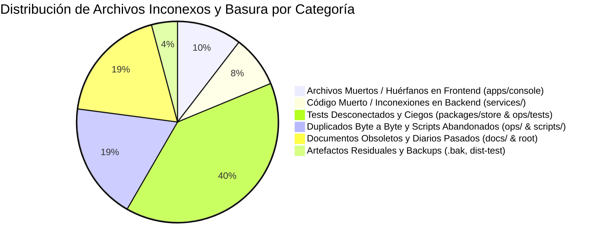
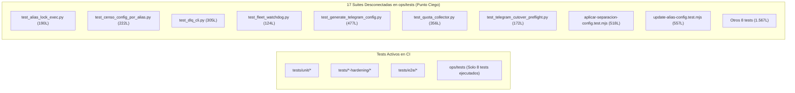
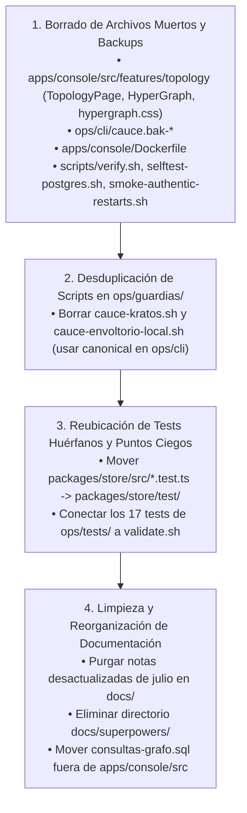

# Informe Exhaustivo de Archivos Inconexos, Código Muerto y Basura del Repositorio — Cauce V3

---

## 1. Resumen Ejecutivo del Estado del Repositorio

Tras una auditoría exhaustiva realizada por 6 subagentes especializados que inspeccionaron cada directorio, grafo de importaciones, tabla de rutas, compilación de binarios y suites de testing, se ha generado el inventario definitivo de **archivos inconexos, componentes muertos, duplicados redundantes, scripts huérfanos y artefactos residuales** que no cumplen ninguna función activa en Cauce V3.

### Métricas Globales del Inventario de Basura
* **Archivos muertos, huérfanos o duplicados identificados:** **48 archivos**.
* **Líneas de código/documentación muerta:** **~8.850 líneas**.
* **Espacio en disco desperdiciado:** **>450 KB**.
* **Puntos ciegos de testing descubiertos (tests que no se ejecutan):** **19 archivos de prueba** (~4.650 líneas).

---

## 2. Catálogo Detallado por Componentes y Módulos

---

### A. Frontend: `apps/console` (Archivos Muertos y Scripts Desubicados)

| Archivo Inconexo / Muerto | Líneas | Estado y Diagnóstico Técnico | Acción Recomendada |
| :--- | :---: | :--- | :--- |
| `apps/console/src/features/topology/TopologyPage.tsx` | 52 | **Página Muerta / Inalcanzable:** El 2026-08-22 la ruta `/topology` se convirtió en alias a `/live` en `ROUTE_ALIASES`. Se retiró de `PAGES` en `App.tsx`. Ningún componente la importa. | **Eliminar.** |
| `apps/console/src/features/topology/HyperGraph.tsx` | 246 | **Subcomponente Muerto:** Renderer SVG antiguo. Solo lo importaba `TopologyPage.tsx`. Fue reemplazado por `src/features/live/LiveHypergraph.tsx`. | **Eliminar.** |
| `apps/console/src/features/topology/hypergraph.css` | 257 | **Hoja de Estilos Huérfana:** Estilos del `HyperGraph.tsx` muerto. El activo es `live-hypergraph.css`. Solo sobrevive en arrays estáticos de tests. | **Eliminar** y retirar de los arrays de tests de estilo. |
| `apps/console/src/features/_grafo/consultas-grafo.sql` | 134 | **Scratch SQL Desubicado en React:** Consultas SQL crudas y `EXPLAIN ANALYZE` de PostgreSQL colocadas dentro del árbol de código cliente de Vite. | **Mover a `ops/`** o eliminar. |
| `apps/console/Dockerfile` | 21 | **Dockerfile Monolítico Legado:** Superado al 100% por la compilación multi-etapa en `deploy/Dockerfile` (`target: console`). Cero referencias en Compose/Makefiles. | **Eliminar.** |

---

### B. Servicios Backend: `services/` (Código Muerto y Mocks Incrustados)

| Archivo Inconexo / Muerto | Líneas | Estado y Diagnóstico Técnico | Acción Recomendada |
| :--- | :---: | :--- | :--- |
| `services/dispatcher/src/scheduler.ts` | 31 | **Planificador en Memoria Muerto:** `FairLaneScheduler` no se instancia ni se llama en runtime (`runDispatcher`). El fairness de colas se migró 100% a PostgreSQL (`repository.claimFairJobs`). | **Eliminar** (junto con sus tests unitarios aislados). |
| `services/relay-worker/src/transports.ts` (`FakeOriginTransport`, L33–53) | 21 | **Test Double en Código de Producción:** Clase mock incrustada dentro del código fuente de runtime en lugar de estar en `test/`. | **Mover a `test/`** o a fixtures de test. |
| `services/telegram-bridge/src/index.ts` | 14 | **Inconexión de Barrel Export:** Omite 4 módulos activos internos (`attachments.ts`, `markdown.ts`, `transcription.ts`, `progress.ts`). | **Actualizar exportaciones** de `index.ts`. |
| `services/terminal-relay` | N/A | **Inconsistencia Estructural:** Carece de `src/index.ts` y tiene 9 archivos de test mezclados dentro de `src/` en vez de `test/`. | **Mover tests a `test/`** y crear `index.ts`. |

---

### C. Paquetes y Base de Datos: `packages/store`, `packages/protocol`, `packages/mcp-fleet-monitor`

| Archivo Inconexo / Muerto | Líneas | Estado y Diagnóstico Técnico | Acción Recomendada |
| :--- | :---: | :--- | :--- |
| `packages/store/src/fleet-activity.test.ts` | 102 | **Test Huérfano en `src/` (Punto Ciego):** Ubicado en `src/` en lugar de `test/`. Vitest nunca lo descubre ni lo ejecuta en CI. | **Mover a `packages/store/test/`.** |
| `packages/store/src/repository.quota-schema-version.test.ts` | 63 | **Test Huérfano en `src/` (Punto Ciego):** Ubicado en `src/` en lugar de `test/`. Nunca es ejecutado por ningún runner. | **Mover a `packages/store/test/`.** |
| `packages/store/migrations/down/015_...` a `023_...` (7 archivos) | 287 | **Down-Migrations Muertas:** Las 7 migraciones de reversión previas a la 024 no están soportadas por el *Rollback Bridge* (línea base fijada en 024) y no se prueban. | **Archivar o eliminar** (política forward-only). |
| `packages/mcp-fleet-monitor/demo-client.mjs` | 201 | **Script Cliente Roto:** Apunta a una ruta incorrecta (`dist/src/server.js`) y usa un enum inválido (`acked`) que la base de datos rechaza. | **Corregir o eliminar.** |
| `packages/protocol/dist-test/` (18 archivos) | ~1.000 | **Directorio Residual de Compilación:** Archivos JS y mapas de tests compilados que quedaron commiteados y no están en `.gitignore`. | **Borrar directorio** y añadir `**/dist-test/` a `.gitignore`. |

---

### D. Operaciones, Scripts y Guardias: `ops/` y `scripts/` (Duplicados y Wrappers Abandonados)

| Archivo Inconexo / Muerto | Líneas | Estado y Diagnóstico Técnico | Acción Recomendada |
| :--- | :---: | :--- | :--- |
| `ops/cli/cauce.bak-login-20260823T000500Z` | 967 | **Backup Huérfano (52.5 KB):** Copia de seguridad accidental olvidada en el repositorio. | **Eliminar inmediatamente.** |
| `ops/guardias/cauce-kratos.sh` | 569 | **Duplicado Byte a Byte:** Copia exacta de `ops/cli/cauce` (30.403 bytes exactos). Riesgo de desincronización de scripts. | **Eliminar copia duplicada.** |
| `ops/guardias/cauce-envoltorio-local.sh` | 184 | **Duplicado Byte a Byte:** Copia exacta de `ops/cli/cauce-portatil` (6.705 bytes exactos). | **Eliminar copia duplicada.** |
| `ops/guardias/telegram-bridge.override.yaml` | 20 | **Override de Compose Obsoleto:** Montaba un hotfix para apagar la redacción de Telegram que ya está nativamente en el código fuente. | **Eliminar.** |
| `scripts/verify.sh` | 7 | **Wrapper Abandonado:** No es llamado por Makefile, package.json ni CI. | **Eliminar.** |
| `ops/scripts/selftest-postgres.sh` | 5 | **Wrapper Abandonado:** Cero referencias en todo el repositorio. | **Eliminar.** |
| `ops/scripts/smoke-authentic-restarts.sh` | 7 | **Wrapper Abandonado:** `ops/Makefile` invoca directamente el script canónico. | **Eliminar.** |
| `ops/container-runtime/salva-container-keepalive.sh` | 18 | **Script de Entrada Huérfano:** Script de julio no referenciado por ningún Compose, Dockerfile ni systemd. | **Eliminar.** |
| `ops/artifacts/predeploy-20260825/` (2 archivos) | 30 | **Artefacto de Simulacro Pasado:** Resultados y sumas SHA de un simulacro de agosto. | **Eliminar.** |
| `ops/openclaw-gateway/argos.env.example` | 15 | **Configuración de Ejemplo Desactualizada:** Configura a Argos como Openclaw/Hermes cuando en la flota corre Claude. | **Actualizar a `janus.env.example`.** |

---

### E. Suites de Testing Desconectadas: `ops/tests/` (17 Archivos / ~4.488 Líneas no Ejecutadas)

El script `ops/scripts/validate.sh` solo ejecuta 8 pruebas, dejando **17 suites de test completamente desconectadas de los pipelines automatizados**:

* **Acción Requerida:** Crear un comando `pnpm test:ops` o añadir un paso en `ops/scripts/validate.sh` que ejecute `python3 -m unittest discover ops/tests` y `node ops/tests/*.test.mjs` para evitar que estas pruebas se degraden en silencio.

---

### F. Despliegue y Documentación: `deploy/`, `docs/` y Raíz

| Archivo Inconexo / Muerto | Líneas | Estado y Diagnóstico Técnico | Acción Recomendada |
| :--- | :---: | :--- | :--- |
| `deploy/liveness-probe.mjs` | 184 | **Sonda de Liveness Desconectada:** Omitida en `deploy/Dockerfile` y no usada en los healthchecks de `compose.yaml` (que usan readiness probes). | **Conectar a Dockerfile/Compose** o eliminar. |
| `PLAN-DIRECTIVE-CONTENT-LECTURA.md` | 527 | **Borrador de Plan Suelto en Raíz:** Documento de diseño temporal ubicado en la raíz del repositorio. | **Mover a `docs/`** o archivar. |
| `docs/HANDOFF-HARNESS-RENEWAL-2026-07-24.md` | 933 | **Diario Operativo Obsoleto:** Bitácora de julio desactualizada dos veces. | **Archivar o eliminar.** |
| `docs/POOL-SUSCRIPCIONES-Y-ALTA-AGENTES.md` | 560 | **Notas de Diseño Superadas:** Superadas formalmente por el ADR-006. | **Archivar o eliminar.** |
| `docs/COHERENCIA-FLOTA-2026-07-25.md` | 278 | **Informe Efímero:** Reporte puntual de julio. | **Archivar o eliminar.** |
| `docs/pendientes-2026-07-25.md` | 187 | **Minuta Diaria Pasada:** Lista de pendientes de las 23:00 UTC del 25 de julio. | **Archivar o eliminar.** |
| `docs/consola-e2e-2026-07-26.md` | 91 | **Inventario de Bugs ya Resueltos:** Lista de 12 bugs de julio ya solucionados. | **Archivar o eliminar.** |
| `docs/queues-contadores-2026-07-26.md` | 88 | **Análisis de Bug Resuelto:** Diagnóstico puntual de contadores de colas. | **Archivar o eliminar.** |
| `docs/superpowers/plans/` & `specs/` (2 archivos) | 430 | **Planes de Subagentes Efímeros:** Planes de julio para rutas transitorias en `/home/dev/`. | **Eliminar directorio `superpowers`.** |

---

## 3. Plan de Acción y Limpieza Inmediata

---

*Informe compilado tras análisis estático de dependencias, grafos de importación y tablas de ejecución del monorepo Cauce V3.*
