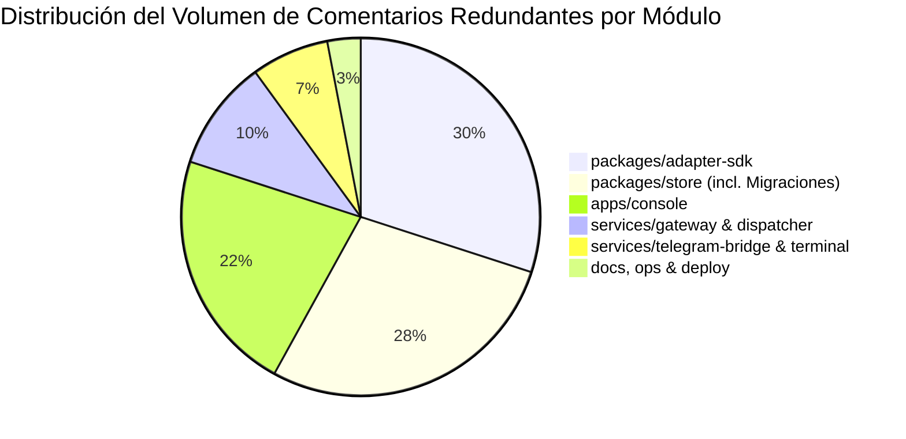
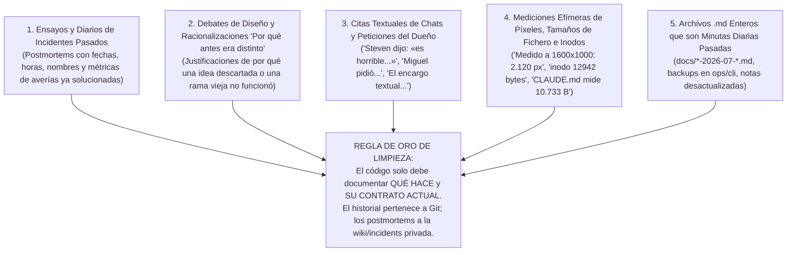
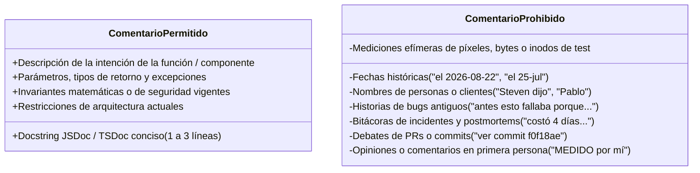

# Plan e Inventario Integral de Limpieza de Comentarios Históricos y Contaminación de Contexto — Cauce V3

---

## 1. Diagnóstico Ejecutivo del Problema

Tras una auditoría exhaustiva y agresiva realizada por 6 subagentes especializados sobre la totalidad del repositorio, se ha identificado una **contaminación masiva de contexto** originada por comentarios que no aportan ningún valor a la ejecución, compilación ni comprensión técnica del sistema en su estado actual.

### 1.1 Métricas Globales del Desperdicio
* **Archivos afectados:** Más de **180 archivos de código fuente y pruebas**.
* **Líneas de comentarios y prosa narrativa redundante:** Más de **5.200 líneas de texto**.
* **Archivos completos obsoletos / diarios pasados:** **17 archivos** (~285 KB de texto) entre notas históricas, volcados y runbooks conversacionales.
* **Impacto en Ventana de Contexto:** Se estima que estos comentarios y archivos consumen **entre 28.000 y 35.000 tokens** innecesarios en cada lectura amplia del repositorio por parte de agentes y modelos LLM.

---

## 2. Tipologías de Comentarios a Eliminar

Los comentarios detectados se clasifican en 5 patrones tóxicos que deben ser erradicados:

---

## 3. Plan de Limpieza Priorizado por Módulos y Focos Críticos

---

### FASE 1: Eliminación Inmediata de Archivos Obsoletos y Diarios (~285 KB / ~35.000 tokens)

Estos archivos son documentos completos que ya no tienen vigencia o backups que nunca debieron commitearse:

| Archivo a Eliminar / Archivar | Tamaño | Motivo de Eliminación |
| :--- | :--- | :--- |
| `docs/HANDOFF-HARNESS-RENEWAL-2026-07-24.md` | 35.8 KB | 933 líneas de diario operativo de julio. En la línea 5 avisa que está desactualizado dos veces. |
| `docs/POOL-SUSCRIPCIONES-Y-ALTA-AGENTES.md` | 38.8 KB | 560 líneas de reflexiones de sesiones de diseño y logs de servidores MCP colgados. |
| `docs/COHERENCIA-FLOTA-2026-07-25.md` | 16.1 KB | Informe de auditoría puntual de una corrida de julio. |
| `docs/pendientes-2026-07-25.md` | 11.0 KB | Minuta de pendientes a las 23:00 UTC del 25 de julio. |
| `docs/consola-e2e-2026-07-26.md` | 5.8 KB | Lista de bugs puntuales de la consola ya resueltos. |
| `docs/queues-contadores-2026-07-26.md` | 5.2 KB | Análisis retrospectivo de un bug de contadores ya corregido. |
| `docs/superpowers/plans/2026-07-24-*.md` | 13.8 KB | Plan efímero de ejecución de subagentes para `/home/dev/.claude/`. |
| `docs/superpowers/specs/2026-07-24-*.md` | 5.2 KB | Especificación efímera de subagentes de julio. |
| `ops/cli/cauce.bak-login-20260823T000500Z` | 52.5 KB | Fichero de backup huérfano de 967 líneas olvidado en el repositorio. |
| `ops/runbooks/handoff-codex-directiva-20260825.md`| 16.2 KB | Diario conversacional con citas textuales de chat. |
| `ops/runbooks/manual-del-medico.md` | 15.2 KB | Ensayo conversacional con historias de clientes ("Pablo estuvo nueve días sin respuesta..."). |
| `ops/runbooks/hardening-2026-07-25.md` | 17.3 KB | Minuta con recordatorios de calendario de julio ("correr el 2026-09-20"). |
| `ops/runbooks/directiva-lectura-de-gobierno-20260825.md`| 5.2 KB | Postmortem de 7 fallos ya resueltos. |
| `ops/runbooks/consola-rama-fuera-de-main.md` | 5.7 KB | Documento de rama divergente ya superada. |
| `ops/console-login/README.md` | 29.1 KB | 448 líneas de narrativa sobre cómo costó descubrir certificados proxy. |

---

### FASE 2: Depuración en `packages/store` y Migraciones SQL (~1.600 líneas de comentarios)

#### 2.1 El Gran Foco: `packages/store/src/repository.ts` (Archivo de >550 KB)
* **Líneas 178–205 (Ensayo de 28 líneas sobre el incidente de Janus):** Relato de cómo Janus estuvo 17,36 horas emitiendo 60 ACKs/h y consumió el 32,7% de la base.
  - *Acción:* Reemplazar por 2 líneas de JSDoc indicando el límite de ejecución total (`lease cap`) por defecto (12h).
* **Líneas 3870–3905 (Ensayo de 35 líneas "INTEGRACIÓN 2026-07-29"):** Discusión de ramas git sobre dónde aplicar el techo de concurrencia y esperas de 114 min.
  - *Acción:* Reducir a especificación concisa de la separación entre cupo general y reserva humana.
* **Líneas 4163–4185 (Ensayo "Dos juicios, no uno" y 387 respuestas perdidas):** Desglose por agente (argos 250, kratos 23, iza 21, zeus 20) y prosa emotiva ("la asimetría era grotesca").
  - *Acción:* Dejar solo la distinción técnica entre caducidad de exclusividad de lease y validez del resultado.
* **Líneas 4726–4796 (Bloque masivo de 70 líneas de salvamento tardío):** Tablas de cálculo de recuperación empírica (188/495 vs 307).
  - *Acción:* Resumir en 4 líneas documentando las 4 condiciones requeridas para aplicar `lateTerminalSalvage`.
* **Líneas 5993–5999 (Incidente de 99.241 fallos en `FOR SHARE`):** Narrativa del bug de ventana de PostgreSQL del 26 de julio.
  - *Acción:* Mantener únicamente la nota técnica: "Usar `rowCount`; `COUNT(*) OVER ()` no está permitido con `FOR SHARE` en PostgreSQL".
* **Líneas 7595–7648 & 8022–8055 (Incidente de cuota de ChatGPT Pro quemada en 5 horas):** Postmortem con nombres personales y raíces mudas.
  - *Acción:* Reducir a la explicación de los umbrales de inactividad de cadenas (`chainSilenceIdleMs`, etc.).
* **Líneas 8330–8369 (Incidente del 4 de agosto "Hueco de plomería" / Jarvis esperando 17 ramas):** Relato de un operador que ejecutó `UPDATE` directo en SQL.
  - *Acción:* Explicar limpiamente la condición de carrera en el cálculo de ramas completadas vs registradas.

#### 2.2 Migraciones SQL (`packages/store/migrations/013_...sql` a `027_...sql`)
* **`018_terminal_recovery_backfill.sql` (Líneas 3–54):** Tabla ASCII completa de la base de datos de producción del 28 de julio y drama de re-numeración de migraciones colisionadas.
* **`020_agent_role_brief.sql` (Líneas 3–29):** Censo de inodos compartidos de contenedores y crisis de identidad de agentes.
* **`026_agent_profile.sql` (Líneas 4–24, 47–88):** Ratios de prompt (185:1) y relato del incidente del "alias sordo" por UTF-16 vs puntos de código.
* **`013`, `014`, `015`, `016`, `017`, `019`, `021`, `023`, `024`, `027`:** Eliminar cabeceras narrativas y dejar exclusivamente la sentencia DDL y un comentario de 1 línea sobre la intención del esquema.

---

### FASE 3: Depuración en `packages/adapter-sdk` (~1.500 líneas de comentarios)

#### 3.1 `src/shared-session/paste-runner.ts`
* **Líneas 80–86, 164–200, 211–274, 1133–1144, 1620–1623:** Más de 13 bloques de comentarios con bitácoras de incidentes de entregas fallidas (`6c7cb0c4`), explicaciones de salidas (a, b, c, d), mediciones de tiempo de Miguel y Kratos (60:00 clavados), y volcados de pruebas tmux.
  - *Acción:* Eliminar todas las citas de incidentes y dejar comentarios concisos sobre el parser de transcripts y el ciclo de vida del pane.

#### 3.2 `src/sdk/engine.ts` & `src/harnesses/shared.ts`
* **`engine.ts` Líneas 227–257 (Ensayo de 31 líneas sobre peticiones del dueño):** "Estar SIEMPRE disponibles", midas 114 min, 71 entregas en vuelo.
* **`engine.ts` Líneas 1224–1263 (Ensayo de 40 líneas sobre commits y conversaciones):** Cita del commit `44521b6`, crecimiento de transcripts a 1.8 MB.
* **`shared.ts` Líneas 144–165 & 205–228 (Ensayos de identidad y deber primario):** Estadísticas de Argos (1069 delegaciones vs 114 respuestas) y debates lingüísticos sobre inglés vs castellano.
* **`shared.ts` Líneas 348–387 (Tabla de diagnósticos que un CLI imprime en vez de trabajar):** Listado de fallos históricos con conteo de entregas.
  - *Acción:* Sustituir por descripciones técnicas del contrato de salida y los discriminantes de error.

#### 3.3 `src/sdk/output-parser.ts` & `src/sdk/account-credentials.ts`
* **`output-parser.ts` Líneas 253–277 & 359–427:** Listado de entregas perdidas por tenant (Steven, Jhon, Miguel, Pablo), horas exactas (16:13, 16:16, 18:24) y recuentos de caracteres de informes.
* **`account-credentials.ts` Líneas 1–42:** Ensayo sobre directorios compartidos `/datos/agents/shared/.claude` y plan de migración paso a paso en comentarios.
  - *Acción:* Eliminar nombres de usuarios y tablas de incidentes; documentar solo las reglas de parsing y resolución de credenciales.

#### 3.4 `src/context/` y `src/harnesses/contexto-fijo.ts`
* **`contexto-fijo.ts` Líneas 8–36 & `siembra-del-perfil.ts` Líneas 12–48:** Ensayos sobre benchmarks de caracteres (7.694 vs 62 = 161 a 1), anécdotas en primera persona ("una prueba mía se puso roja por leer mi CLAUDE.md de verdad").
  - *Acción:* Dejar solo la especificación del sellado SHA-256 y la política de inyección de bloques.

---

### FASE 4: Depuración en `apps/console` (~1.400 líneas de comentarios)

#### 4.1 `App.tsx` y Enrutamiento
* **Líneas 69–157 (Ensayo de 88 líneas del menú):** Historia de las 5 reformas del menú, fechas 2026-08-06 y 2026-08-22, conteo de rutas (13 vs 11 vs 8), y consulta de `pg_stat_user_tables` con `n_tup_ins = 0`.
* **Líneas 204–275 (Ensayo de 71 líneas de `ROUTE_ALIASES`):** Historia de cada alias de ruta con hashes de commit (`f0f18ae`) y sesiones reales de usuarios.
  - *Acción:* Reducir el menú y los alias a sus estructuras de datos TypeScript limpias con un JSDoc de 2 líneas.

#### 4.2 `styles.css` (Más de 250 líneas de comentarios personales)
* Eliminar todas las quejas de chat transcritas ("Steven por segunda vez: «la vista de configuraciones...»"), reflexiones en primera persona ("MEDIDO por mí en Chrome", "lo causé yo al subir la insignia"), y explicaciones de selectores CSS borrados (`.publish-form`, `.message-list`).

#### 4.3 Vistas y Componentes (`DirectivaModal.tsx`, `AccountsPage.tsx`, `MessagesPage.tsx`, `activity.ts`)
* **`DirectivaModal.tsx` & `DirectivaTab.tsx`:** Eliminar citas textuales ("Steven dijo: «tienen demasiados datos»") y sumas de píxeles (686 + 387 = 2.120 px).
* **`MessagesPage.tsx` & `composer-anclado.test.ts`:** Eliminar citas ("Steven dijo: «el de mensajes es horrible»") y mediciones de coordenadas (`y=1546`).
* **`activity.ts` (Líneas 10–55):** Eliminar la tabla comparativa ASCII de discrepancias de vocabulario en pantalla.
* **`campos-inertes.ts` (Líneas 3–19):** Eliminar citas de "El encargo, textual" y comentarios en primera persona ("NO LE ENCONTRÉ LECTOR"), dejando limpia la tabla de justificaciones técnicas.

---

### FASE 5: Depuración en `services/gateway`, `services/dispatcher`, `telegram-bridge` y `terminal-relay` (~700 líneas)

#### 5.1 `services/gateway`
* **`app.ts` (Líneas 1232–1250, 1405–1419, 1941–1964):** Ensayos sobre scripts de Caddy (`patch-caddy-lista-blanca.py`), rutas de documentos 404 y defectos de claim de entregas en lote.
* **`password-auth.ts` (Líneas 10–29, 221–270):** Narrativa sobre el fallo de basic auth de Caddy que filtraba 850 KB de datos de tenants en agosto.
* **`config.ts` (Líneas 54–88):** Derivaciones matemáticas con constantes del incidente de julio y esperas de 114 min de Midas.
* **`console/agent-documents.ts`:** Citas personales ("el que ve Steven", "lo que Steven pidió") y anécdotas de `/proc/<pid>/cmdline`.

#### 5.2 `services/telegram-bridge`
* **`artifacts.ts` (Líneas 4–44):** Historias de usuarios ("Isa pidió un guion cinco veces", "Jhon el 28-jul: 'mandame las capturas'").
* **`redaction.ts` (Líneas 1–35, 172–184):** Ensayos sobre incidentes de credenciales de Neon (`npg_`) filtradas el 2 de agosto y debates de falsos positivos.
* **`untrusted.ts` (Líneas 1–52):** Rants sobre librerías npm desactualizadas y debates sobre UTS#39.
* **`poller.ts` (Líneas 224–238, 529–539):** Incidente de `heraclito` del 5 de agosto donde 4 mensajes de Steven quedaron parados durante horas.

#### 5.3 `services/terminal-relay`
* **`sessions.ts` & `agent-leg.ts`:** Anécdotas sobre terminales que mandaban `rows:1` y mataban sesiones en vivo el 24 de agosto.

---

## 4. Guía y Convención de Buenas Prácticas Post-Limpieza

Para mantener el repositorio limpio y proteger el contexto de futuros agentes y desarrolladores, se establece la siguiente norma estricta:

### Reglas Clave:
1. **El historial pertenece a Git:** Los mensajes de commit y las descripciones de PR son el lugar para explicar por qué se cambió algo respecto al pasado. El código fuente solo explica **cómo funciona hoy**.
2. **Los postmortems pertenecen a la documentación privada de operaciones:** Incidentes específicos con nombres de clientes, logs y capturas deben residir en `docs/incident-archive/` o en un sistema de ticketing, nunca dispersos como comentarios en medio de la lógica de negocio.
3. **Cero fechas y cero nombres personales en comentarios de código:** Ningún archivo `.ts`, `.tsx`, `.sql` o `.py` debe incluir fechas de parches pasados ni menciones a desarrolladores u operadores.

---

*Plan de limpieza estructurado y listo para ejecución por fases.*
