# Grafo de dependencias del repo

Generado por `pnpm grafo` (determinista — regenerar tras reordenar). Nodo = directorio; arista A→B = ficheros de A que referencian ficheros de B (peso = nº de referencias). Mapa navegable: [Arquitectura visual de Cauce V3](diagramas/cauce-v3.architecture.html).

## El grafo (aristas con peso ≥2)

```mermaid
graph LR
  node_scripts["scripts"] -->|149| node_packages_adapter_sdk["packages/adapter-sdk"]
  node_scripts["scripts"] -->|138| node_console["console"]
  node_scripts["scripts"] -->|85| node_packages_store["packages/store"]
  node_packages_store["packages/store"] -->|80| node_packages_protocol["packages/protocol"]
  node_scripts["scripts"] -->|80| node_services_gateway["services/gateway"]
  node_scripts["scripts"] -->|68| node_ops_scripts["ops/scripts"]
  node_tests_unit["tests/unit"] -->|57| node_services_gateway["services/gateway"]
  node_services_gateway["services/gateway"] -->|50| node_packages_store["packages/store"]
  node_scripts["scripts"] -->|48| node_tests_unit["tests/unit"]
  node_packages_store["packages/store"] -->|43| node_tests_helpers["tests/helpers"]
  node_services_gateway["services/gateway"] -->|38| node_packages_protocol["packages/protocol"]
  node_scripts["scripts"] -->|36| node_ops_tests["ops/tests"]
  node_scripts["scripts"] -->|33| node_services_telegram_bridge["services/telegram-bridge"]
  node_tests_gateway_hardening["tests/gateway-hardening"] -->|33| node_services_gateway["services/gateway"]
  node_tests_unit["tests/unit"] -->|33| node_ops_scripts["ops/scripts"]
  node_packages_adapter_sdk["packages/adapter-sdk"] -->|30| node_packages_protocol["packages/protocol"]
  node_scripts["scripts"] -->|29| node_ops_pty_agent["ops/pty-agent"]
  node_scripts["scripts"] -->|25| node_services_terminal_relay["services/terminal-relay"]
  node_ops_tests["ops/tests"] -->|21| node_ops_scripts["ops/scripts"]
  node_console["console"] -->|20| node_packages_store["packages/store"]
  node_scripts["scripts"] -->|19| node_tests_gateway_hardening["tests/gateway-hardening"]
  node_tests_store_hardening["tests/store-hardening"] -->|19| node_packages_store["packages/store"]
  node_scripts["scripts"] -->|17| node_packages_protocol["packages/protocol"]
  node_scripts["scripts"] -->|16| node_deploy_runtime["deploy/runtime"]
  node_tests_unit["tests/unit"] -->|16| node_packages_store["packages/store"]
  node_tests_unit["tests/unit"] -->|14| node_ops_observability["ops/observability"]
  node__raiz_["(raiz)"] -->|13| node_scripts["scripts"]
  node_tests_unit["tests/unit"] -->|13| node_packages_protocol["packages/protocol"]
  node_ops_scripts["ops/scripts"] -->|12| node_ops["ops"]
  node_ops_tests["ops/tests"] -->|12| node_ops_harness["ops/harness"]
  node_tests_gateway_hardening["tests/gateway-hardening"] -->|11| node_packages_store["packages/store"]
  node_tests_unit["tests/unit"] -->|11| node_services_telegram_bridge["services/telegram-bridge"]
  node_console["console"] -->|10| node_packages_protocol["packages/protocol"]
  node_console["console"] -->|10| node_services_gateway["services/gateway"]
  node_services_telegram_bridge["services/telegram-bridge"] -->|10| node_packages_store["packages/store"]
  node_services_telegram_bridge["services/telegram-bridge"] -->|10| node_packages_protocol["packages/protocol"]
  node_tests_gateway_hardening["tests/gateway-hardening"] -->|10| node_packages_protocol["packages/protocol"]
  node_ops_scripts["ops/scripts"] -->|9| node_deploy["deploy"]
  node_scripts["scripts"] -->|9| node_ops_guardias["ops/guardias"]
  node_scripts["scripts"] -->|9| node_tests_terminal_pty["tests/terminal-pty"]
  node_services_dispatcher["services/dispatcher"] -->|9| node_packages_store["packages/store"]
  node_tests_store_hardening["tests/store-hardening"] -->|9| node_tests_helpers["tests/helpers"]
  node_tests_store_hardening["tests/store-hardening"] -->|8| node_services_gateway["services/gateway"]
  node_tests_unit["tests/unit"] -->|8| node_packages_adapter_sdk["packages/adapter-sdk"]
  node_console["console"] -->|7| node_packages_adapter_sdk["packages/adapter-sdk"]
  node_scripts["scripts"] -->|7| node_tests_store_hardening["tests/store-hardening"]
  node_tests_e2e["tests/e2e"] -->|7| node_services_gateway["services/gateway"]
  node_tests_unit["tests/unit"] -->|7| node_scripts["scripts"]
  node_ops_tests["ops/tests"] -->|6| node_ops["ops"]
  node_tests_unit["tests/unit"] -->|6| node_deploy["deploy"]
  node_tests_unit["tests/unit"] -->|6| node_deploy_runtime["deploy/runtime"]
  node__raiz_["(raiz)"] -->|5| node_ops_scripts["ops/scripts"]
  node_scripts["scripts"] -->|5| node_services_dispatcher["services/dispatcher"]
  node_tests_gateway_hardening["tests/gateway-hardening"] -->|5| node_tests_helpers["tests/helpers"]
  node_tests_store_hardening["tests/store-hardening"] -->|5| node_packages_protocol["packages/protocol"]
  node_ops_scripts["ops/scripts"] -->|4| node_services_telegram_bridge["services/telegram-bridge"]
  node_ops_tests["ops/tests"] -->|4| node_deploy_runtime["deploy/runtime"]
  node_ops_tests["ops/tests"] -->|4| node_services_gateway["services/gateway"]
  node_scripts["scripts"] -->|4| node_deploy["deploy"]
  node_scripts["scripts"] -->|4| node_ops_harness["ops/harness"]
  node_scripts["scripts"] -->|4| node_packages_mcp_fleet_monitor["packages/mcp-fleet-monitor"]
  node_tests_integration["tests/integration"] -->|4| node_tests_helpers["tests/helpers"]
  node_tests_terminal_pty["tests/terminal-pty"] -->|4| node_services_terminal_relay["services/terminal-relay"]
  node_tests_unit["tests/unit"] -->|4| node_services_dispatcher["services/dispatcher"]
  node_deploy["deploy"] -->|3| node_ops_observability["ops/observability"]
  node_deploy_runtime["deploy/runtime"] -->|3| node_packages_store["packages/store"]
  node_ops_scripts["ops/scripts"] -->|3| node_ops_harness["ops/harness"]
  node_ops_tests["ops/tests"] -->|3| node_tests_e2e["tests/e2e"]
  node__raiz_["(raiz)"] -->|3| node_ops_tests["ops/tests"]
  node__raiz_["(raiz)"] -->|3| node_ops_harness["ops/harness"]
  node_packages_mcp_fleet_monitor["packages/mcp-fleet-monitor"] -->|3| node_packages_store["packages/store"]
  node_scripts["scripts"] -->|3| node_tests_integration["tests/integration"]
  node_tests_e2e["tests/e2e"] -->|3| node_tests_helpers["tests/helpers"]
  node_tests_unit["tests/unit"] -->|3| node_ops_schemas["ops/schemas"]
  node_ops_pty_agent["ops/pty-agent"] -->|2| node_ops_scripts["ops/scripts"]
  node_ops_scripts["ops/scripts"] -->|2| node_packages_adapter_sdk["packages/adapter-sdk"]
  node_ops_scripts["ops/scripts"] -->|2| node_packages_protocol["packages/protocol"]
  node_ops_scripts["ops/scripts"] -->|2| node_console["console"]
  node_ops_scripts["ops/scripts"] -->|2| node_ops_observability["ops/observability"]
  node_ops_tests["ops/tests"] -->|2| node_tests_helpers["tests/helpers"]
  node_ops_tests["ops/tests"] -->|2| node_ops_schemas["ops/schemas"]
  node_ops_tests["ops/tests"] -->|2| node_packages_store["packages/store"]
  node__raiz_["(raiz)"] -->|2| node_services_gateway["services/gateway"]
  node__raiz_["(raiz)"] -->|2| node_packages_store["packages/store"]
  node__raiz_["(raiz)"] -->|2| node_console["console"]
  node_packages_store["packages/store"] -->|2| node_deploy["deploy"]
  node_packages_store["packages/store"] -->|2| node_packages_adapter_sdk["packages/adapter-sdk"]
  node_scripts["scripts"] -->|2| node_ops_container_runtime["ops/container-runtime"]
  node_scripts["scripts"] -->|2| node_ops_patches["ops/patches"]
  node_scripts["scripts"] -->|2| node_tests_e2e["tests/e2e"]
  node_services_dispatcher["services/dispatcher"] -->|2| node_tests_helpers["tests/helpers"]
  node_services_gateway["services/gateway"] -->|2| node_tests_helpers["tests/helpers"]
  node_services_telegram_bridge["services/telegram-bridge"] -->|2| node_tests_helpers["tests/helpers"]
  node_tests_e2e["tests/e2e"] -->|2| node_ops_harness["ops/harness"]
  node_tests_integration["tests/integration"] -->|2| node_packages_store["packages/store"]
  node_tests_integration["tests/integration"] -->|2| node_services_gateway["services/gateway"]
  node_tests_store_hardening["tests/store-hardening"] -->|2| node_ops_scripts["ops/scripts"]
  node_tests_terminal_pty["tests/terminal-pty"] -->|2| node_services_gateway["services/gateway"]
  node_tests_unit["tests/unit"] -->|2| node_ops_guardias["ops/guardias"]
```

## Aristas completas

| Desde | Hacia | Refs |
|---|---|---|
| scripts | packages/adapter-sdk | 149 |
| scripts | console | 138 |
| scripts | packages/store | 85 |
| packages/store | packages/protocol | 80 |
| scripts | services/gateway | 80 |
| scripts | ops/scripts | 68 |
| tests/unit | services/gateway | 57 |
| services/gateway | packages/store | 50 |
| scripts | tests/unit | 48 |
| packages/store | tests/helpers | 43 |
| services/gateway | packages/protocol | 38 |
| scripts | ops/tests | 36 |
| scripts | services/telegram-bridge | 33 |
| tests/gateway-hardening | services/gateway | 33 |
| tests/unit | ops/scripts | 33 |
| packages/adapter-sdk | packages/protocol | 30 |
| scripts | ops/pty-agent | 29 |
| scripts | services/terminal-relay | 25 |
| ops/tests | ops/scripts | 21 |
| console | packages/store | 20 |
| scripts | tests/gateway-hardening | 19 |
| tests/store-hardening | packages/store | 19 |
| scripts | packages/protocol | 17 |
| scripts | deploy/runtime | 16 |
| tests/unit | packages/store | 16 |
| tests/unit | ops/observability | 14 |
| (raiz) | scripts | 13 |
| tests/unit | packages/protocol | 13 |
| ops/scripts | ops | 12 |
| ops/tests | ops/harness | 12 |
| tests/gateway-hardening | packages/store | 11 |
| tests/unit | services/telegram-bridge | 11 |
| console | packages/protocol | 10 |
| console | services/gateway | 10 |
| services/telegram-bridge | packages/store | 10 |
| services/telegram-bridge | packages/protocol | 10 |
| tests/gateway-hardening | packages/protocol | 10 |
| ops/scripts | deploy | 9 |
| scripts | ops/guardias | 9 |
| scripts | tests/terminal-pty | 9 |
| services/dispatcher | packages/store | 9 |
| tests/store-hardening | tests/helpers | 9 |
| tests/store-hardening | services/gateway | 8 |
| tests/unit | packages/adapter-sdk | 8 |
| console | packages/adapter-sdk | 7 |
| scripts | tests/store-hardening | 7 |
| tests/e2e | services/gateway | 7 |
| tests/unit | scripts | 7 |
| ops/tests | ops | 6 |
| tests/unit | deploy | 6 |
| tests/unit | deploy/runtime | 6 |
| (raiz) | ops/scripts | 5 |
| scripts | services/dispatcher | 5 |
| tests/gateway-hardening | tests/helpers | 5 |
| tests/store-hardening | packages/protocol | 5 |
| ops/scripts | services/telegram-bridge | 4 |
| ops/tests | deploy/runtime | 4 |
| ops/tests | services/gateway | 4 |
| scripts | deploy | 4 |
| scripts | ops/harness | 4 |
| scripts | packages/mcp-fleet-monitor | 4 |
| tests/integration | tests/helpers | 4 |
| tests/terminal-pty | services/terminal-relay | 4 |
| tests/unit | services/dispatcher | 4 |
| deploy | ops/observability | 3 |
| deploy/runtime | packages/store | 3 |
| ops/scripts | ops/harness | 3 |
| ops/tests | tests/e2e | 3 |
| (raiz) | ops/tests | 3 |
| (raiz) | ops/harness | 3 |
| packages/mcp-fleet-monitor | packages/store | 3 |
| scripts | tests/integration | 3 |
| tests/e2e | tests/helpers | 3 |
| tests/unit | ops/schemas | 3 |
| ops/pty-agent | ops/scripts | 2 |
| ops/scripts | packages/adapter-sdk | 2 |
| ops/scripts | packages/protocol | 2 |
| ops/scripts | console | 2 |
| ops/scripts | ops/observability | 2 |
| ops/tests | tests/helpers | 2 |
| ops/tests | ops/schemas | 2 |
| ops/tests | packages/store | 2 |
| (raiz) | services/gateway | 2 |
| (raiz) | packages/store | 2 |
| (raiz) | console | 2 |
| packages/store | deploy | 2 |
| packages/store | packages/adapter-sdk | 2 |
| scripts | ops/container-runtime | 2 |
| scripts | ops/patches | 2 |
| scripts | tests/e2e | 2 |
| services/dispatcher | tests/helpers | 2 |
| services/gateway | tests/helpers | 2 |
| services/telegram-bridge | tests/helpers | 2 |
| tests/e2e | ops/harness | 2 |
| tests/integration | packages/store | 2 |
| tests/integration | services/gateway | 2 |
| tests/store-hardening | ops/scripts | 2 |
| tests/terminal-pty | services/gateway | 2 |
| tests/unit | ops/guardias | 2 |
| console | scripts | 1 |
| deploy/runtime | packages/protocol | 1 |
| deploy/runtime | packages/adapter-sdk | 1 |
| deploy/runtime | services/gateway | 1 |
| deploy/runtime | services/dispatcher | 1 |
| deploy/runtime | services/telegram-bridge | 1 |
| deploy/runtime | services/terminal-relay | 1 |
| ops | ops/harness | 1 |
| ops/pty-agent | services/gateway | 1 |
| ops/scripts | ops/pty-agent | 1 |
| ops/scripts | services/gateway | 1 |
| ops/scripts | tests/gateway-hardening | 1 |
| ops/scripts | ops/schemas | 1 |
| ops/tests | ops/container-runtime | 1 |
| ops/tests | ops/guardias | 1 |
| ops/tests | ops/manifests | 1 |
| ops/tests | ops/observability | 1 |
| ops/tests | services/dispatcher | 1 |
| ops/tests | services/telegram-bridge | 1 |
| ops/tests | services/terminal-relay | 1 |
| ops/tests | packages/protocol | 1 |
| ops/tests | packages/adapter-sdk | 1 |
| (raiz) | deploy | 1 |
| (raiz) | services/dispatcher | 1 |
| (raiz) | services/telegram-bridge | 1 |
| packages/adapter-sdk | packages/store | 1 |
| packages/mcp-fleet-monitor | tests/integration | 1 |
| packages/mcp-fleet-monitor | packages/protocol | 1 |
| packages/store | services/telegram-bridge | 1 |
| packages/store | deploy/runtime | 1 |
| scripts | docs/diagramas | 1 |
| scripts | deploy/postgres | 1 |
| scripts | ops/openclaw-gateway | 1 |
| scripts | tests/helpers | 1 |
| services/dispatcher | deploy | 1 |
| services/terminal-relay | packages/protocol | 1 |
| services/terminal-relay | tests/terminal-pty | 1 |
| tests/e2e | packages/adapter-sdk | 1 |
| tests/e2e | services/dispatcher | 1 |
| tests/e2e | ops/scripts | 1 |
| tests/gateway-hardening | tests/store-hardening | 1 |
| tests/gateway-hardening | deploy | 1 |
| tests/gateway-hardening | packages/adapter-sdk | 1 |
| tests/helpers | packages/store | 1 |
| tests/integration | packages/adapter-sdk | 1 |
| tests/integration | packages/protocol | 1 |
| tests/store-hardening | services/telegram-bridge | 1 |
| tests/store-hardening | tests/gateway-hardening | 1 |
| tests/terminal-pty | ops/pty-agent | 1 |
| tests/unit | tests/helpers | 1 |
| tests/unit | deploy/console | 1 |
| tests/unit | tests/terminal-pty | 1 |
| tests/unit | ops/pty-agent | 1 |
| tests/unit | ops/harness | 1 |
| tests/unit | tests/e2e | 1 |
| tests/unit | console | 1 |
| (raiz) | packages/protocol | 1 |
| (raiz) | packages/adapter-sdk | 1 |

## Hubs (los 15 ficheros más referenciados)

- packages/protocol/src/index.ts ← 192
- packages/store/src/index.ts ← 152
- console/src/api/types.ts ← 127
- packages/adapter-sdk/src/sdk/types.ts ← 93
- tests/helpers/postgres.ts ← 74
- console/src/mocks/server.ts ← 62
- console/src/test/render.tsx ← 61
- services/gateway/src/auth.ts ← 61
- packages/store/src/db.ts ← 52
- packages/store/test/postgres-suite.ts ← 51
- console/src/components/ui.tsx ← 46
- console/src/lib.ts ← 44
- packages/adapter-sdk/src/sdk/durable-store.ts ← 44
- packages/adapter-sdk/src/harnesses/index.ts ← 33
- services/telegram-bridge/src/types.ts ← 32

## Candidatos huérfanos (fuente sin UNA referencia entrante detectada — verificar antes de tocar)

- console/qa/layout-baseline.json
- console/src/features/terminal/terminal.worker.ts
- console/src/main.tsx
- grupos.json
- ops/flota-fisica.json
- ops/generated/fleet.json
- ops/guardias/catalogo-mouseion-health.sh
- ops/guardias/telegram-bridge.override.yaml
- ops/manifests/argos.yaml
- ops/manifests/atlas.yaml
- ops/manifests/gaia.yaml
- ops/manifests/hegel.yaml
- ops/manifests/heraclito.yaml
- ops/manifests/iza.yaml
- ops/manifests/janus.yaml
- ops/manifests/jarvis.yaml
- ops/manifests/kratos.yaml
- ops/manifests/salva.yaml
- ops/manifests/socrates.yaml
- ops/manifests/tales.yaml
- ops/manifests/zeus.yaml
- ops/schemas/alias-manifest.schema.json
- ops/scripts/fleet_derive.py
- ops/scripts/refresh-profile-expectation.sh
- ops/telegram-runtime/config.json
- packages/adapter-sdk/manifests/claude.json
- packages/adapter-sdk/manifests/codex.json
- packages/adapter-sdk/manifests/fake.json
- packages/adapter-sdk/manifests/hermes.json
- packages/adapter-sdk/manifests/openclaw.json
- packages/adapter-sdk/manifests/opencode.json
- packages/adapter-sdk/scripts/chmod-bins.mjs
- packages/adapter-sdk/scripts/copy-bridges.mjs
- packages/adapter-sdk/scripts/package-smoke.mjs
- pnpm-lock.yaml
- pnpm-workspace.yaml

## Tamaño por nodo

| Nodo | Ficheros |
|---|---|
| console | 323 |
| packages/adapter-sdk | 186 |
| packages/store | 111 |
| services/gateway | 102 |
| tests/unit | 82 |
| ops/scripts | 67 |
| services/telegram-bridge | 44 |
| ops/tests | 43 |
| services/terminal-relay | 35 |
| ops/pty-agent | 27 |
| packages/protocol | 22 |
| tests/gateway-hardening | 20 |
| deploy/runtime | 18 |
| ops/manifests | 14 |
| services/dispatcher | 12 |
| ops/guardias | 11 |
| scripts | 11 |
| tests/terminal-pty | 10 |
| tests/store-hardening | 9 |
| deploy | 8 |
| ops/harness | 8 |
| (raiz) | 7 |
| packages/mcp-fleet-monitor | 7 |
| ops | 5 |
| ops/observability | 4 |
| tests/integration | 4 |
| tests/e2e | 3 |
| ops/patches | 2 |
| ops/schemas | 2 |
| tests/helpers | 2 |
| deploy/console | 1 |
| deploy/postgres | 1 |
| ops/container-runtime | 1 |
| ops/generated | 1 |
| ops/openclaw-gateway | 1 |
| ops/telegram-runtime | 1 |
